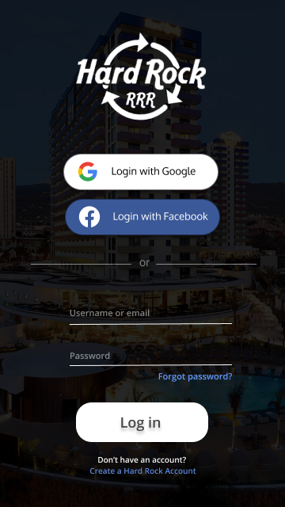
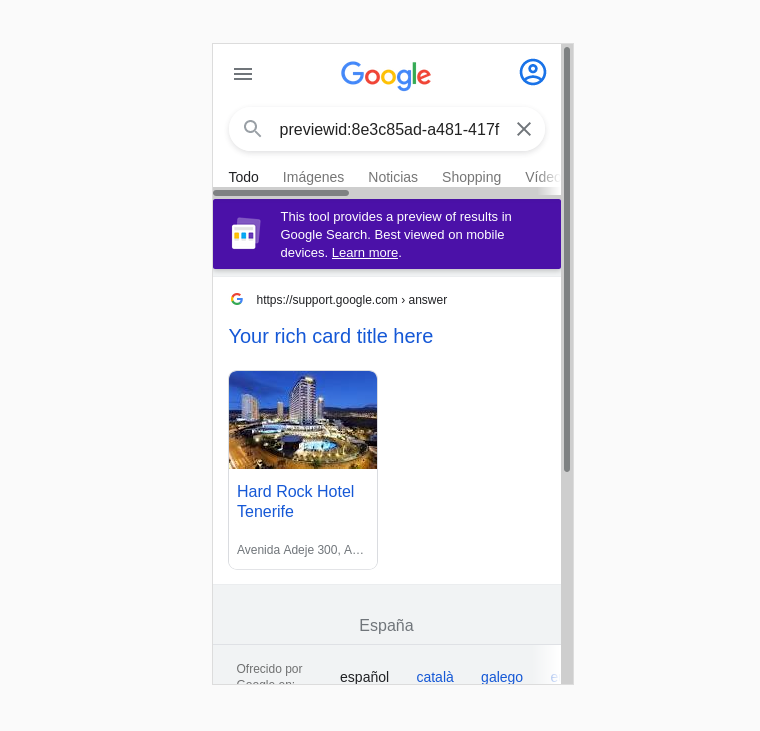
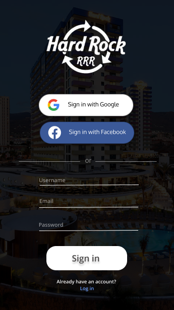
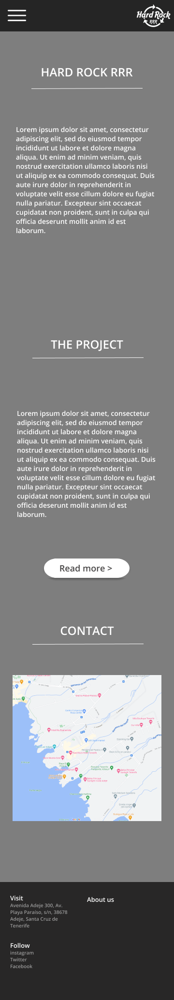
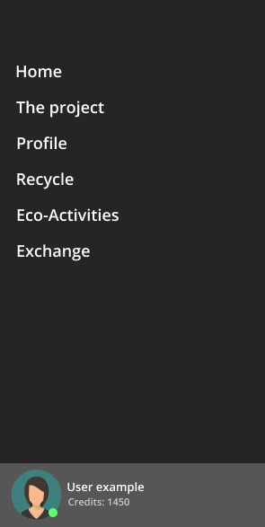
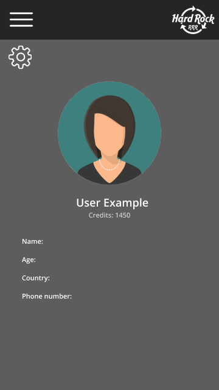
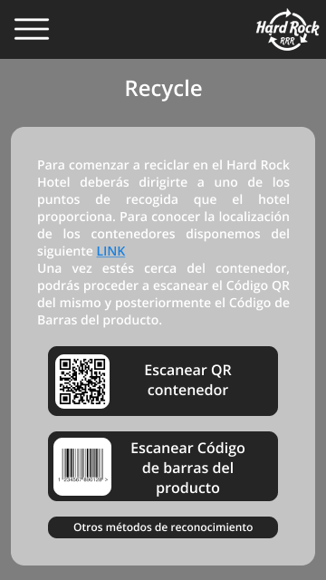
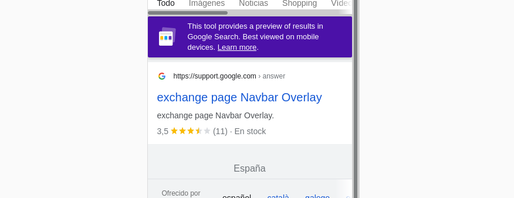

# DATOS ESTRUCTURADOS EN LA WEB

> Nombre: Alejandro Martín de León  
> Contacto: alu0101015941@ull.edu.es

## Índice

1. [Introducción](#introducción)  
2. [Breve descripción de la web](#breve-descripción-de-la-web)
3. [Tipos (clases) principales](#tipos-clases-principales)
4. [Páginas que componen principalmente la web](#páginas-que-componen-principalmente-la-web)  
    4.1. [Index (login)](#index-login)  
    4.2. [Sign in](#sign-in)  
    4.3. [Home](#home)  
    4.4. [Menú desplegable](#menú-desplegable)  
    4.5. [Perfil de usuario](#perfil-de-usuario)  
    4.6. [Página de reciclado](#página-de-reciclado)  
    4.7. [Página de actividades](#página-de-actividades)  
    &nbsp;&nbsp;&nbsp;4.7.1. [Actividad Trail](#actividad-trail)  
    4.8. [Tienda de intercambio de puntos](#tienda-de-intercambios)  


***
## Introducción
***

&nbsp;&nbsp;&nbsp;&nbsp;&nbsp;&nbsp;Los datos estructurados son unos fragmentos de código o etiquetado que se añaden en las páginas web para proporcionar más información y contexto a los motores de búsqueda sobre el tipo de contenido que se está ofreciendo con la misma.

&nbsp;&nbsp;&nbsp;&nbsp;&nbsp;&nbsp;Gracias a esta información que se proporciona, motores de búsqueda como por ejemplo Google, podrían colocar a la web con los denominados **rich snippets**, o fragmentos enriquecidos, permitiendo así que se visualice aún mejor los datos principales que proporciona la web y por tanto, llamando aún mas la atención de los posibles usuarios. 

&nbsp;&nbsp;&nbsp;&nbsp;&nbsp;&nbsp;Todo esto es posible con **Schema**, un vocabulario estructurado de datos que define entidades, acciones, y relaciones en Internet. 

&nbsp;&nbsp;&nbsp;&nbsp;&nbsp;&nbsp;En los siguientes apartados se procede a detallar las diferentes páginas principales con las que se ha construido el prototipo de la web propuesto.

***
## Breve descripción de la web
***

&nbsp;&nbsp;&nbsp;&nbsp;&nbsp;&nbsp;La web propuesta, se resume básicamente en una aplicación web que emplea un sistema de recompenas orientado a los huéspedes del Hard Rock Hotel como incentivo para realizar actividades de reciclado o ecológicas tanto fuera como dentro de la infraestructura del hotel. 

&nbsp;&nbsp;&nbsp;&nbsp;&nbsp;&nbsp;Principalmente existen dos formas de obtener recompensas, una de ellas es la de reciclar en los contenedores inteligentes que se encuentra por las instalaciones del hotel, donde el huésped podrá definir qué tipo de producto está reciclando así como de indicar en qué dispositivo lo está llevando a cabo. Por otro lado, el otro método que se define para colaborar con el medioambiente, son una lista de actividades propuesta por el hotel o terceros con fines educativos, de ocio, entre otros. Al realizar una actividad de este estilo, y después de haber colaborado con el medioambiente, se procederá a realizar un ingreso de créditos en la cuenta del huésped.

&nbsp;&nbsp;&nbsp;&nbsp;&nbsp;&nbsp;Al final, el huésped podrá realizar la compra de algún producto o servicio a cambio de los puntos obtenidos.

***
## Tipos (Clases) principales
***
&nbsp;&nbsp;&nbsp;&nbsp;&nbsp;&nbsp;El vocabulario Schema incluye formatos para estructurar datos sobre toda clase de personas, lugares y cosas de la web. Al añadir este marcado sobre la web se permite a los motores de búsqueda entener de qué trata y qué elementos la componen.

&nbsp;&nbsp;&nbsp;&nbsp;&nbsp;&nbsp;Para el caso que se plantea en este informe, los tipos o clases principales que se encuentran son: 

- Hotel
- Reciclaje


***
## Páginas que componen principalmente la web
***

&nbsp;&nbsp;&nbsp;&nbsp;&nbsp;&nbsp;A continuación se encuentra una descripción de cada una de las páginas que componen principalmente la web propuesta, así como de una imágen conceptual del prototipo y el detalle del tipo de Schema elegido para cada una.

***
### Index (Login)
***

&nbsp;&nbsp;&nbsp;&nbsp;&nbsp;&nbsp;Esta es la página principal de la web. Desde aquí será necesario que el huésped se loguee o bien, cree una cuenta en el sistema antes de acceder al entorno de la web. Se adjunta a continuación una imágen de su aspecto:



&nbsp;&nbsp;&nbsp;&nbsp;&nbsp;&nbsp;Debido a que se trata de la página de Login de usuarios, la única clase que se ha definido en este caso es para Hotel: 

```html
<script type="application/ld+json">
    {
        "@context": "https://schema.org",
        "@type": "Hotel",
        "name": "Hard Rock Hotel Tenerife",
        "description": "Hard Rock Hotel Tenerife es un hotel completamente renovado, situado en la isla volcánica de Tenerife (en la costa noroeste de África en el océano Atlántico), uno de los destinos más fascinantes del mundo donde Hard Rock Hotel Tenerife ha encontrado su nuevo hogar en las soleadas costas del sur de Adeje y estamos listos para revolucionar tus vacaciones cuando nos elijas para tu próxima escapada a las Islas Canarias",
        "address": {
            "@type": "PostalAddress",
            "addressCountry": "SPAIN",
            "addressLocality": "Santa Cruz de Tenerife",
            "addressRegion": "Islas Canarias",
            "postalCode": "38670",
            "streetAddress": "Avenida Adeje 300, Avenida Playa Paraíso"
        },
        "telephone": "922055022",
        "image": "https://media-cdn.tripadvisor.com/media/photo-s/0e/25/2a/06/exterior.jpg",
        "starRating": {
            "@type": "Rating",
            "ratingValue": "5"
        },
        "priceRange": "100€ - 900€"
    }
</script>  
```

&nbsp;&nbsp;&nbsp;&nbsp;&nbsp;&nbsp;Donde se ha definido la Clase Hotel y algunas de las etiquetas más importantes para la misma. En este caso, tras ser comprobado por la [Prueba de Resultados Enriquecidos](https://search.google.com/test/rich-results) se puede comprobar lo siguiente: 



&nbsp;&nbsp;&nbsp;&nbsp;&nbsp;&nbsp;Tal y como se puede observar, se ha creado una **rich card** con la descripción que se dió sobre el hotel previamente.

***
### Sign in
***



&nbsp;&nbsp;&nbsp;&nbsp;&nbsp;&nbsp;Para el caso de la página de registro de usuario se ha llevado a cabo un esquema de la misma estructura que el login, donde además se ha detallado la acción de registro con el Tipo RegisterAction de la siguiente forma: 

```html
<script type="application/ld+json">
    {
      "@context": "https://schema.org",
      "@type": "RegisterAction",
      "agent": {
        "@type": "Person",
        "name": "usuario1"
      },
      "object": {
        "@type": "Product",
        "name": "Hard Rock RRR"
      }
    }
</script>
```


***
### Home
***



&nbsp;&nbsp;&nbsp;&nbsp;&nbsp;&nbsp;Para el caso de la pantalla Home, aparecen más elementos que pueden ser representados mediante el Schema. En primer lugar se encuentra, tal y como se hizo anteriormente para el login, establecer la clase Hotel. Por otro lado, en esta página se hace mención del proyecto, así como de una breve descripción del mismo. Es por ello, por lo que se va a crear un esquema JSON-LD de tipo Project: http

```html
<script type="application/ld+json">
    {
        "@context": "https://schema.org",
        "@type": "Project",
        "name": "Hard Rock RRR",
        "description": "Proyecto sobre la economía circular en el Hard Rock Tenerife",
        "funder": "Hard Rock Hotel Tenerife", 
        "employee": {
            "@type": "Person",
            "name": "Alejandro Martín de León",
            "email": "alu0101015941@ull.edu.es",
            "jobTitle": "Developer",
            "nacionality": "Spain"
        },
        "address": {
            "@type": "PostalAddress",
            "addressCountry": "SPAIN",
            "addressLocality": "Santa Cruz de Tenerife",
            "addressRegion": "Islas Canarias",
            "postalCode": "38670",
            "streetAddress": "Avenida Adeje 300, Avenida Playa Paraíso"
        }
    }   
</script>
```
&nbsp;&nbsp;&nbsp;&nbsp;&nbsp;&nbsp;A diferencia del esquema creado con la clase Hotel, esta clase Project, al ser pasado por la prueba de resultados enriquecidos, no lo detecta. Esto sucede principalmente porque, tal y como aparece al inicio de su [recurso online](https://schema.org/Project), se presenta como que se encuentra en estado pendiente de aceptación por parte de la web.

&nbsp;&nbsp;&nbsp;&nbsp;&nbsp;&nbsp;Para la clase Map pasa algo parecido y es que no se toma en cuanta como resultado enriquecido. Por lo que parece, según se detalla en la web [Prueba de resultados enriquecidos](https://support.google.com/webmasters/answer/7445569#zippy=%2Csupported-types) no todos los resultados definidos por el Schema.

&nbsp;&nbsp;&nbsp;&nbsp;&nbsp;&nbsp;En adición se ha creado el esquema SoftwareApplication, que permitirá definir una serie de características informativas sobre la aplicación creada.

***
### Menú desplegable
***

&nbsp;&nbsp;&nbsp;&nbsp;&nbsp;&nbsp;Para el menú desplegable del Navbar no se precisa realmente un esquema distinto de los ya creados en otras páginas.



***
### Perfil de usuario
***



&nbsp;&nbsp;&nbsp;&nbsp;&nbsp;&nbsp;Para la página de perfil de usuario no se precisan en principio ningún tipo de esquema en principio. En versiones futuras del prototipo se espera tener un sistema de seguidores dentro de la aplicación, donde usuarios se podrán comparar entre ellos mediante estadísticas. 

&nbsp;&nbsp;&nbsp;&nbsp;&nbsp;&nbsp;Para ello se puede definir la acción BeFriendAction, donde se podrá detallar la acción de un usuario que es amigo de otro: 

```
<script type="application/ld+json">

{
  "@context": "https://schema.org",
  "@type": "BefriendAction",
  "agent": {
    "@type": "Person",
    "name": "usuario1"
  },
  "object": {
    "@type": "Person",
    "name": "usuario2"
  }
}
    </script>
```

&nbsp;&nbsp;&nbsp;&nbsp;&nbsp;&nbsp;En el código mostrado con anterioridad se puede observar cómo se han definido dos usuarios con la acción de seguir.

***
### Página de reciclado
***



&nbsp;&nbsp;&nbsp;&nbsp;&nbsp;&nbsp;En esta pantalla se detalla a acción del proceso de reciclar. Para ello, se ha de emplear el uso del escaneo tanto de código QR como de código de barras. En este caso se ha aplicado la clase Barcode para establecer el día que se ha subido y el usuario que lo ha hecho: 

```
<script type="application/ld+json">

        {
          "@context": "https://schema.org",
          "@type": "Barcode",
          "name": "barcode"
          "uploadDate": {
            "@type": "Date",
            "dateCreated": "10/10/2010"
          },
          "creator": {
            "@type": "Person",
            "name": "usuario1"
          }
        }
        </script>
```
Lo mismo sería para el QR. 


***
### Página de actividades
***


&nbsp;&nbsp;&nbsp;&nbsp;&nbsp;&nbsp;Sobre esta página se encuentran una serie de eventos o actividades que se van a celebrar en los próximos días, a los que los huéspedes van a poder participar. En este caso, se plantea el esquema JSON-LD como eventos. Se podrá añadir sobre este esquema además la imagen que le corresponde a cada evento.

```html
<script type="application/ld+json">
    {
      "@context": "https://schema.org/",
      "@type": "Article",
      "name": "Eco Trail",
      "description": "Se trata de una aventura por uno de los senderos más conocidos de la Isla de Tenerife...",

      "about": {
        "@type": "Event",
        "name": "Eco Trail",
        "location": "Pico del Teide",
      "startDate": "2020-07-10 15:00:00.000"
      }
      

    }
    </script>
```

***
#### Actividad Trail
***

&nbsp;&nbsp;&nbsp;&nbsp;&nbsp;&nbsp;En este caso, el esquema será similar, solo que se podrá añadir los créditos de recompoensa por la actividad.


***
### Tienda de intercambios
***

&nbsp;&nbsp;&nbsp;&nbsp;&nbsp;&nbsp;Por último, para el caso de la tienda, se han de añadir los productos que se encuentran sobre la pantalla. Para ello se ha de utilizar la clase Product. Aunque no se ha detallado en el prototipado, sería una buena idea incluir una pantalla adicional donde se pueda ver información más precisa del producto, o incluso algunos comentarios. Esto podría ser de la siguiente manera: 

```html
<script type="application/ld+json">
    {
      "@context": "https://schema.org",
      "@type": "Product",
      "aggregateRating": {
        "@type": "AggregateRating",
        "ratingValue": "3.5",
        "reviewCount": "11"
      },
      "description": "Camiseta 50th",
      "name": "Camiseta 50th",
      "image": "camiseta.jpg",
      "offers": {
        "@type": "Offer",
        "availability": "https://schema.org/InStock",
        "price": "1000",
        "priceCurrency": "credits"
      },
      "review":
        {
          "@type": "Review",
          "author": "usuario1",
          "datePublished": "2011-04-01",
          "reviewBody": "La camisa esta bien",
          "reviewRating": {
            "@type": "Rating",
            "bestRating": "5",
            "ratingValue": "4",
            "worstRating": "4"
          }
        }
    }
    </script>  
```
De esto se obtiene la siguiente vista previa: 



[Volver a inicio](#datos-estructurados-en-la-web)